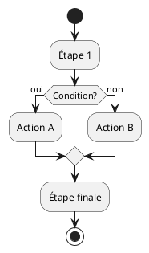

# 📊 Diagrammes d'Activité UML - PlantUML

Ce dossier contient les diagrammes d'activité UML de l'API Text-to-SQL au format PlantUML.

---

## 📁 Fichiers Disponibles

### 1. **activity-diagram-simple.puml** ⭐ (Pour Non-Techniques)
Diagramme simplifié du flux principal Text-to-SQL avec termes accessibles.

**Utilisation recommandée pour :**
- Présentations aux décideurs
- Documentation utilisateur
- Formation des utilisateurs finaux

### 2. **activity-diagram-technical.puml** (Pour Développeurs)
Diagramme détaillé avec tous les composants techniques et phases.

**Utilisation recommandée pour :**
- Documentation technique
- Onboarding développeurs
- Revues d'architecture

### 3. **activity-diagram-indexing.puml** (Indexation)
Flux d'enregistrement des exemples SQL dans la mémoire du système.

### 4. **activity-diagram-inflation.puml** (Analyse Inflation)
Flux d'interprétation des prévisions d'inflation avec SHAP.

---

## 🎨 Visualiser les Diagrammes

### Option 1 : En Ligne (Rapide)

**PlantUML Web Server:**
1. Aller sur http://www.plantuml.com/plantuml/uml/
2. Copier-coller le contenu d'un fichier `.puml`
3. Cliquer sur "Submit"

**PlantText:**
1. Aller sur https://www.planttext.com/
2. Coller le code PlantUML
3. Le diagramme s'affiche automatiquement

### Option 2 : VS Code (Recommandé)

**Installation de l'extension :**
1. Ouvrir VS Code
2. Aller dans Extensions (Ctrl+Shift+X)
3. Chercher "PlantUML"
4. Installer l'extension de **jebbs**

**Visualisation :**
1. Ouvrir un fichier `.puml`
2. Appuyer sur `Alt+D` (ou clic droit → "Preview Current Diagram")
3. Le diagramme s'affiche à côté

**Export en image :**
- Format PNG : Clic droit → "Export Current Diagram"
- Choisir le dossier de destination

### Option 3 : Ligne de Commande

**Prérequis :**
```bash
# Installer Java
# Télécharger plantuml.jar depuis http://plantuml.com/download

# Générer une image PNG
java -jar plantuml.jar activity-diagram-simple.puml

# Générer tous les diagrammes
java -jar plantuml.jar *.puml
```

### Option 4 : Docker

```bash
# Utiliser l'image Docker officielle
docker run --rm -v ${PWD}:/data plantuml/plantuml activity-diagram-simple.puml
```

---

## 📖 Exemple de Code PlantUML



---

## 🎯 Diagrammes Exportés (Images)

Pour faciliter l'utilisation, voici comment générer les images :

```bash
# Générer tous les diagrammes en PNG
java -jar plantuml.jar -tpng *.puml

# Ou avec Docker
docker run --rm -v ${PWD}:/data plantuml/plantuml -tpng *.puml
```

Cela créera :
- `activity-diagram-simple.png`
- `activity-diagram-technical.png`
- `activity-diagram-indexing.png`
- `activity-diagram-inflation.png`

---

## 🔧 Personnalisation

### Changer les Couleurs

```plantuml
|#CouleurHex|Nom de la Lane|
```

Couleurs disponibles :
- `#LightBlue` - Bleu clair
- `#LightGreen` - Vert clair
- `#LightYellow` - Jaune clair
- `#Pink` - Rose
- `#Orange` - Orange
- `#Cyan` - Cyan

### Ajouter des Notes

```plantuml
:Action;
note right
  Ceci est une note
  explicative
end note
```

### Créer des Partitions

```plantuml
partition "Nom de la Phase" {
  :Étape 1;
  :Étape 2;
}
```

---

## 📚 Documentation PlantUML

- **Site Officiel :** https://plantuml.com/
- **Guide Activity Diagram :** https://plantuml.com/activity-diagram-beta
- **Exemples :** https://real-world-plantuml.com/

---

## 🤝 Contribution

Pour modifier ou ajouter des diagrammes :

1. Éditer le fichier `.puml` correspondant
2. Tester la visualisation
3. Générer l'image PNG si nécessaire
4. Commit les changements

---

## 💡 Conseils

### Pour Présentations
- Utilisez `activity-diagram-simple.puml` (langage accessible)
- Exportez en PNG haute résolution
- Ajoutez des notes explicatives

### Pour Documentation Technique
- Utilisez `activity-diagram-technical.puml` (détaillé)
- Gardez à jour avec le code
- Ajoutez des références aux fichiers sources

### Pour Formation
- Commencez par le diagramme simple
- Progressez vers le technique
- Utilisez les diagrammes spécialisés (indexing, inflation)

---

## 🎨 Exemple de Sortie

Voici à quoi ressemble un diagramme PlantUML rendu :

```
┌──────────────┐
│    start     │
└──────┬───────┘
       │
       ▼
┌──────────────┐
│ Poser une    │
│  question    │
└──────┬───────┘
       │
       ▼
┌──────────────┐
│  Recevoir    │
│  réponse     │
└──────┬───────┘
       │
       ▼
┌──────────────┐
│     stop     │
└──────────────┘
```

---

**[⬆ Retour à la documentation](README.md)**
